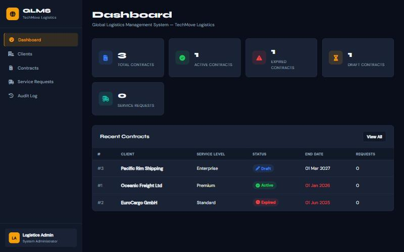
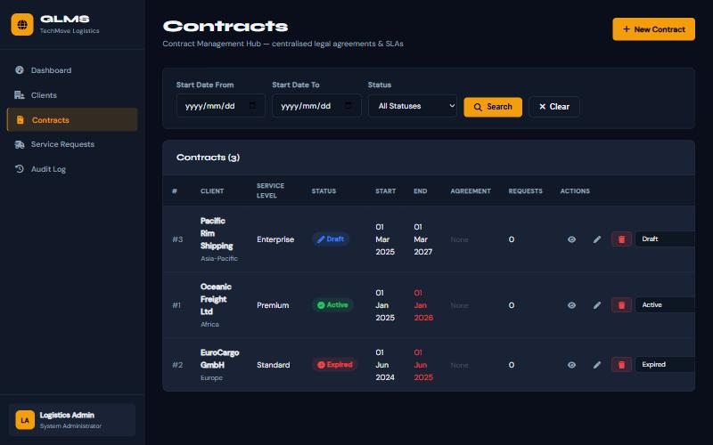

# GLMS — Global Logistics Management System

    [](https://github.com/Letlhogonolo-Kgatshe/glms-contract-management/actions/workflows/ci.yml)

A contract and service-request management platform for a logistics company (TechMove Logistics). It has a **REST API backend, a Blazor Server frontend and a SQL Server database**, and is built around three Gang-of-Four design patterns.

▶ **[Video demo](https://youtu.be/TWxagCLS1yQ)**



## Features

- **Dashboard:** live counts of total, active, expired and draft contracts and service requests, plus recent contracts.
- **Contract management:** create, edit and delete contracts, upload signed PDF agreements, and filter by date range and status. Contracts that have ended are highlighted.
- **Service requests:** raised against a contract and blocked automatically when the contract is not in a valid state.
- **Live currency conversion:** shows USD → ZAR as you type, using a live exchange-rate API.
- **Audit log:** every contract status change is recorded.
- **Clients:** client records with region and contact details.



## Design patterns

| Pattern | Interface | Implementation | Used where |
|---|---|---|---|
| **Factory** | `IContractFactory` | `ContractFactory` | Creates Draft or Active contracts |
| **Observer** | `IContractObserver` | `ContractObserver` | `ContractService.UpdateStatusAsync` logs status changes to the audit log |
| **Strategy** | `IValidationStrategy` | `ActiveContractValidationStrategy`, `ContractDateValidationStrategy`, `CompositeValidationStrategy` | `ServiceRequestService.CreateAsync` blocks invalid contract states |

## Architecture

```
GLMS.POE.Frontend  (Blazor Server, typed HttpClients)
        │  HTTP/JSON
        ▼
GLMS.POE.Backend   (ASP.NET Core Web API · Swagger · EF Core)
        │
        ▼
SQL Server / LocalDB

GLMS.POE.Shared    (models and DTOs shared by both tiers)
```

| Layer | Tech |
|---|---|
| Frontend | Blazor Server (.NET 8) |
| Backend | ASP.NET Core Web API (.NET 10), Swagger / OpenAPI |
| Data | Entity Framework Core, SQL Server (LocalDB for development) |
| External | open.er-api.com exchange rates |
| DevOps | Dockerfile for the frontend |

## Running locally

**Prerequisites:** .NET 10 SDK and SQL Server LocalDB (installed with Visual Studio).

1. Create the database. Either apply the EF migrations:
   ```bash
   dotnet ef database update --project GLMS.POE.Backend
   ```
   or run `SQLQuery1.sql` against `(localdb)\MSSQLLocalDB`.
2. Start the API:
   ```bash
   dotnet run --project GLMS.POE.Backend --urls http://localhost:5285
   ```
3. Start the frontend in a second terminal:
   ```bash
   dotnet run --project GLMS.POE.Frontend --urls http://localhost:5290 --ApiBaseUrl http://localhost:5285/
   ```
4. Open http://localhost:5290. The API docs are at http://localhost:5285/swagger.

You can also open `GLMS.POE.ST10445158.slnx` in Visual Studio and start both projects together.

## Tests

59 xUnit tests cover the core logic. They run on every push through GitHub Actions.

| Test class | Covers |
|---|---|
| `ContractFactoryTests` | Draft and Active creation, field mapping, and rejecting invalid date ranges |
| `ValidationStrategyTests` | Active-status and date strategies, and the composite strategy |
| `ContractObserverTests` | Status changes are recorded in the audit log |
| `ContractWorkflowTests` | End-to-end contract and service-request flow on an EF Core in-memory database |
| `CurrencyCalculationTests` | USD → ZAR conversion and invalid rates |
| `FileValidationTests` | Only `.pdf` uploads are accepted (rejects .exe, .php, .bat, double extensions and so on) |

```bash
dotnet test GLMS.Tests
```

## Project structure

```
GLMS.POE.Backend/    Controllers, Services (Factory, Observer, Strategy), EF DbContext, Migrations
GLMS.POE.Frontend/   Razor pages: Dashboard, Clients, Contracts, Service Requests, Audit Log
GLMS.POE.Shared/     Shared models
GLMS.Tests/          xUnit tests (Moq, EF Core InMemory)
SQLQuery1.sql        Database schema script
```

---

Built for PROG7311 (Enterprise Application Development), Varsity College, 2026, by **Letlhogonolo Kgatshe**.
